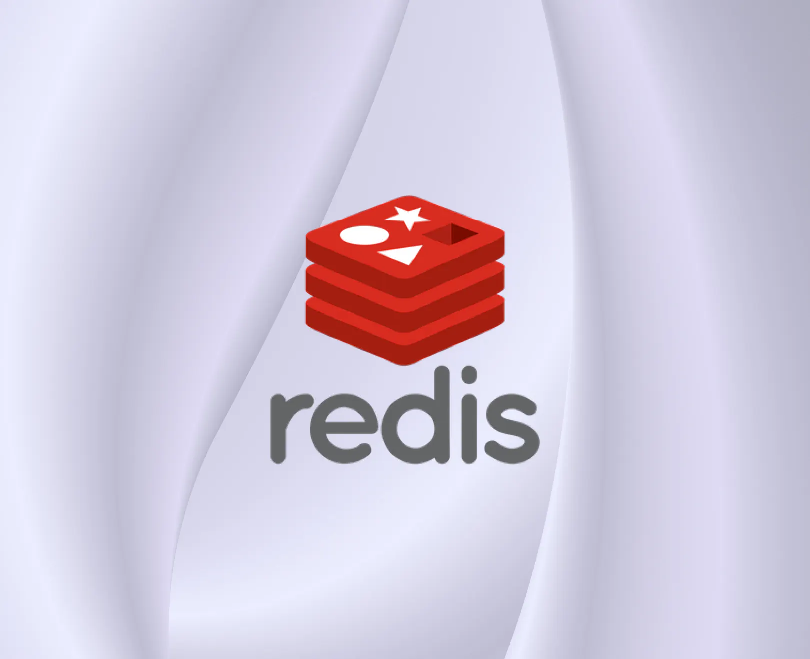
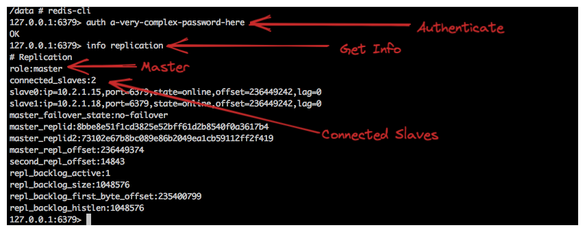
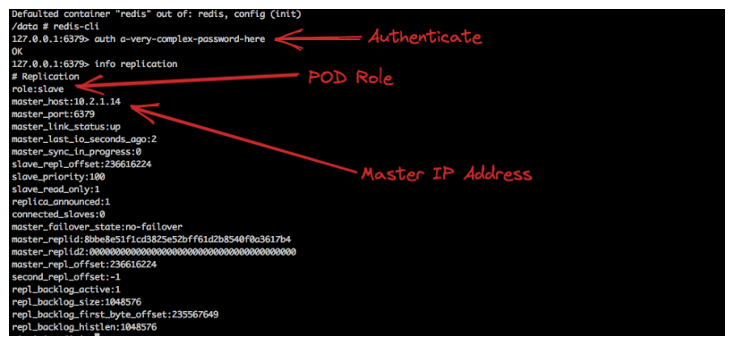

## Deploying Redis cluster on Kubernetes

### resource
https://www.airplane.dev/blog/deploy-redis-cluster-on-kubernetes


### Create a namespace
```shell
kubectl create ns redis
kubectl get ns
```
### Define a storage class
```shell
kubectl apply -f sc.yaml
kubectl get sc
```
### Create a persistent volume
```shell
kubectl apply -f pv.yaml
kubectl get pv
```
### Create the ConfigMap
```shell
kubectl apply -n redis -f redis-config.yaml
kubectl get configmap -n redis
```
### Deploy Redis using StatefulSet
```shell
kubectl apply -n redis -f redis-statefulset.yaml
kubectl get pods -n redis
```
### Create headless service
```shell
kubectl apply -n redis -f redis-service.yaml
kubectl get service -n redis
```
### Check replication
```shell
kubectl -n redis logs redis-0
kubectl -n redis describe pod redis-0

kubectl -n redis exec -it redis-0 -- sh
redis-cli 
auth a-very-complex-password-here
info replication
```


```shell
kubectl -n redis exec -it redis-1 -- sh
redis-cli 
auth a-very-complex-password-here
info replication
```


### Test replication
```shell
kubectl -n redis exec -it redis-0 -- sh
redis-cli 
auth a-very-complex-password-here

SET emp1 raja
SET emp2 mano
SET emp3 ram

KEYS *
1) "emp3"
2) "emp2"
3) "emp1"

kubectl -n redis exec -it redis-1 -- sh
redis-cli
auth a-very-complex-password-here
KEYS *
```


